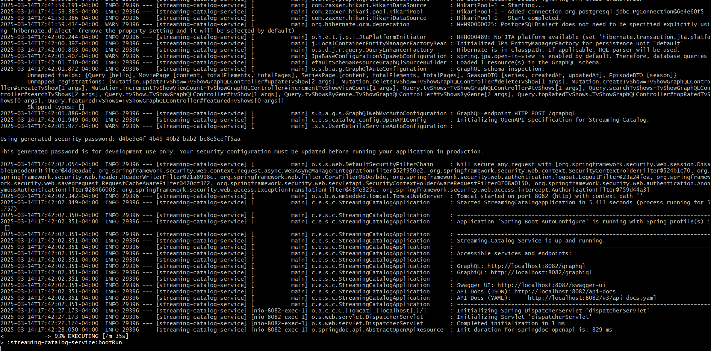
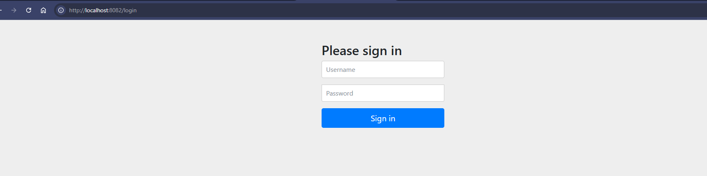
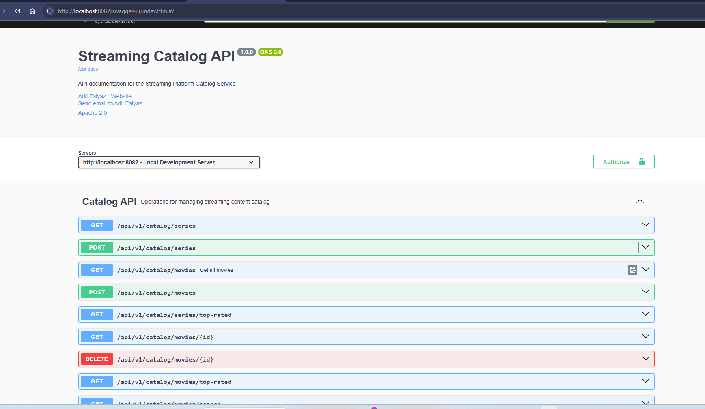
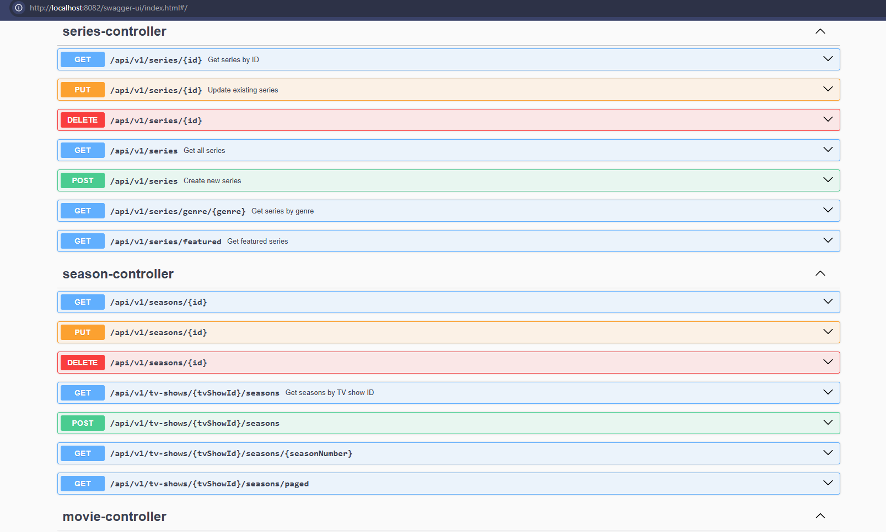

# Streaming Platform Catalog Service

## Overview
The **Streaming Platform Catalog Service** is a microservice responsible for managing movies, series, seasons, and episodes. It provides both **GraphQL and REST APIs**, allowing flexible data retrieval for different clients.

## Available APIs
- **[GraphQL API Documentation](GRAPHQL.md)**
- **[REST API Documentation](RESTAPI.md)**

## Features
- **GraphQL API** for efficient, flexible queries
- **REST API** for standard HTTP-based integrations
- **PostgreSQL Database** for persistence
- **Spring Boot** backend with Spring Data JPA
- **Dockerized Deployment** with multi-stage builds
- **JWT Authentication & Authorization** using Spring Security
- **Batch Loading with DataLoader** to optimize GraphQL queries
- **Caching** with Redis for improved performance
- **Monitoring & Metrics** with Spring Boot Actuator and Prometheus
- **Comprehensive Error Handling** for better debugging
- **Extensive Test Coverage** with unit and integration tests


## Tech Stack
- **Backend:** Java 17, Spring Boot, Spring GraphQL, Spring Security, JWT
- **Database:** PostgreSQL with JPA/Hibernate
- **Caching:** Redis (production) / In-memory (development)
- **APIs:** GraphQL and REST
- **Monitoring:** Spring Boot Actuator, Micrometer, Prometheus
- **Build & Deployment:** Gradle, Docker, GitHub Actions CI/CD
- **Testing:** JUnit 5, Mockito, Spring Test

## Getting Started

### Prerequisites
- Java 17+
- Gradle
- Docker & Docker Compose
- PostgreSQL

### Running Locally

#### Clone the Repository
```sh
git clone https://github.com/your-repo/streaming-platform.git
cd streaming-platform
```


## Start Database with Docker
```sh
docker-compose up -d
```

## Build and run the application
```sh
./gradlew bootRun
```


## Access the APIs

### GraphQL Playground:
```
http://localhost:8082/graphql
```

### REST API Base URL:
```
http://localhost:8082/api/v1
```

### Swagger API Docs:
```
http://localhost:8082/swagger-ui
```

### Monitoring Endpoints:
```
http://localhost:8082/actuator/health       # Health check
http://localhost:8082/actuator/metrics      # Metrics
http://localhost:8082/actuator/prometheus   # Prometheus metrics
```

### Authentication Endpoint:
```
POST http://localhost:8082/api/v1/auth/login
```

Example request body:
```json
{
  "username": "admin",
  "password": "admin"
}
```

### Configuration
Modify _application.yml_ for environment-specific configurations, including:

- Database connection settings
- JWT secret and expiration
- Redis cache configuration
- Security credentials
- API rate limits
- Monitoring endpoints

## Build a Docker Image
```sh
docker build -t streaming-catalog .
```

## Run the container
```sh
docker run -p 8082:8082 streaming-catalog
```


## Security Features

- **JWT Authentication**: Secure token-based authentication
- **Role-Based Access Control**: Fine-grained permissions using OAuth2 scopes
- **HTTPS Support**: Configured for production environments
- **Password Encryption**: BCrypt password hashing
- **API Rate Limiting**: Prevents abuse and DoS attacks

## Performance Optimizations

- **Caching**: Redis-based caching for frequently accessed data
- **Connection Pooling**: Efficient database connection management
- **Pagination**: All collection endpoints support pagination
- **Batch Loading**: Prevents N+1 query problems in GraphQL
- **Query Optimization**: Proper indexing and query tuning

## Monitoring & Observability

- **Health Checks**: Custom health indicators for all components
- **Metrics Collection**: Performance metrics via Micrometer
- **Prometheus Integration**: Exportable metrics for dashboards
- **Request Tracing**: Unique trace IDs for request tracking
- **Structured Logging**: Consistent log format with contextual information

## Testing Strategy

- **Unit Tests**: For service and repository layers
- **Integration Tests**: For API endpoints and database operations
- **Security Tests**: Verify authentication and authorization
- **Performance Tests**: Ensure system meets performance requirements
- **Caching Tests**: Verify cache behavior and eviction policies


## Images

### Image 1


### Image 2


### Image 3


### Image 4

